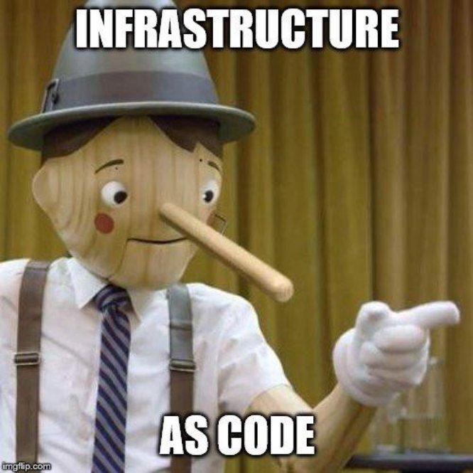
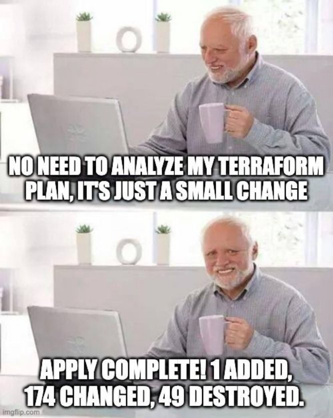
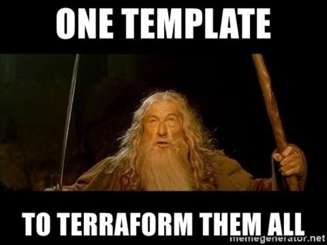

**Understanding Terraform (with Docker containers) 📗🐋**

HashiCorp’s product for infrastructure as a code is called Terraform. It is a tool for safely and repeatedly developing, altering, and controlling infrastructure. HashiCorp Configuration Language (HCL), used for human-readable, automated deployments, is a configuration language that operators and infrastructure teams can use with Terraform to manage environments.



I’m sure you’ve heard of the Infrastructure as Code (IaC) concept if you’re a DevOps engineer or someone who has to deal with DevOps-related work on a daily basis. Simply put, IaC is something that has fallen from Heaven to assist everyday struggling DevOps engineers. IaC is a method of managing and provisioning an entire IT infrastructure by using machine-readable definition files. Using programming scripts helps to automate the entire IT infrastructure.

IaC has numerous advantages. It enables faster execution when configuring infrastructure, reduces the cost and risk associated with implementing infrastructure, has full traceability of changes, and so on.


Nobody does manual infrastructure provision anymore, unless you live under a rock. Terraform is widely used as an infrastructure provisioning tool. In this post, we’ll look at how anyone can get started with Terraform and provision infrastructure on your local machine.

**Prerequisites 🎬**

You’ll need the following before you begin. It is critical to create and configure a local development environment for the terraform. Please install the following tools before proceeding with the CLI.

Links to respective installation guides :

- [Terraform](https://www.terraform.io/) : Ofcourse 😒
- [Docker Desktop](https://www.docker.com/products/docker-desktop) : For running Docker container on your machine
- [Visual Studio Code](https://code.visualstudio.com/) : Code editor to write the Terraform HCL

**Terraform commands ⌨️**

Here are the primary commands :


```terraform
- **terraform init :** Sets up the working directory, which contains all of the configuration files.
- **terraform validate :** Validates a directory’s configuration files.
- **terraform plan** : Creates an execution plan to get the infrastructure to the desired state.
- **terraform apply** : Implements the infrastructure changes specified in the plan.
- **terraform destroy :** Removes all old infrastructure resources.
```


A more detailed guide is provided below :


**Docker side setup 🐳**

We’ll be hosting a simple Nodejs hello world 👋 app using express. Which would look something like this.

![Text

Description automatically generated]

And Dockerizing the same using this as our Dockerfile

![Text

Description automatically generated]

And make sure you build the image locally using

```dockerfile
docker build -t generic-node-app .
```

**Now provisioning infrastructure using Terraform 🛠**

We’ve seen how to manually run this example project on Docker. Let’s see what we can do with the terraform to accomplish this. All we need is one file called **main.tf**, which is shown below.


Terraform configurations must specify which providers are required so that Terraform can install and use them when we run the terraform init command.

```terraform
terraform init
```

Then your directory structure should look something like this :


The next resource is the Docker Image, which we must obtain from DockerHub, and the last is the container creation, which maps internal port 7080 to external port 8080.

{width=250}

And then validate > plan > apply using the following commands :

```terraform
\# And that's about it..terraform validate
terraform plan
terraform apply
```

And voila..


You have successfully deployed Docker components, but you must still verify that they are deployed on the Docker host using Docker commands.

```dockerfile
docker ps -a
```

**Destroy Infrastructure 🏗**

We’ve now seen how to construct and modify infrastructure. We’ll go over how to completely destroy the Terraform-managed infrastructure before moving on to creating multiple resources and displaying resource dependencies.
In production environments, destroying your infrastructure is a rare occurrence. However, destroying is a useful action if you’re using Terraform to spin up multiple environments, such as development, test, and QA environments.

![Text

Description automatically generated]

The terraform destroy command kills the resources specified in your Terraform configuration. This command is the inverse of terraform apply in that it terminates all of the configuration’s resources. It does not destroy resources that are not described in the current configuration that are running elsewhere.$ terraform destroy

```terraform
\# Danger zone.. this destroys everything

terraform destroy
```

**Conclusion 🤔**

You’ve learned how to use Terraform configuration files to deploy and manage Docker images, and containers. You’ve realised that by declaring them in Terraform code, you can create as many containers as you need.




The first step toward taking advantage of containerization technology and reducing overhead is to deploy and manage Docker containers. Why not use this first step to learn more about Docker services and Kubernetes and how they can help your projects?

**Github URL for this article 💻**

<https://github.com/devangtomar/medium-getting-started-with-terraform.git>

**Let’s connect and chat! Open to anything under the sun 🏖️🍹**

🐦 Twitter : [devangtomar7](https://twitter.com/devangtomar7)
🔗 LinkedIn : [devangtomar](https://www.linkedin.com/in/devangtomar)
📚 Stackoverflow : [devangtomar](https://stackoverflow.com/users/8198097/devangtomar)
🖼️ Instagram : [be_ayushmann](https://instagram.com/be_ayushmann)
Ⓜ️ Medium : [Devang Tomar](https://medium.com/u/8f5e1c86129d?source=post_page-----e42119a306ca--------------------------------)
☊ Hashnode : [devangtomar](https://devangtomar.hashnode.dev/)

